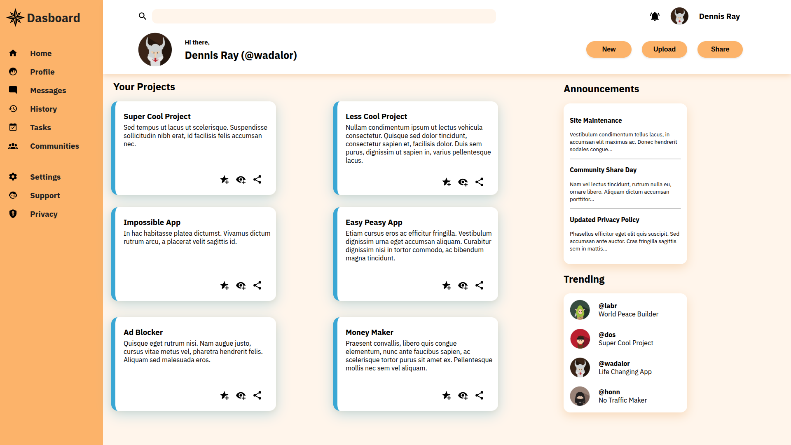

# Admin Dashboard

A modern admin dashboard with responsive interface built using CSS Grid and Flexbox.

## Preview



## Key Features

- **Responsive grid layout** with CSS Grid dividing into sidebar, header and main content areas
- **Interactive elements**:
  - Project card hover animations
  - Button interaction effects
  - Smooth UI transitions
- **Visual design**:
  - Color scheme: `#fcb36a` (orange), `#fff5eb` (cream), `#3aa7d4` (accent blue)
  - Shadows and depth effects
- **Optimized typography**:
  - Custom IBM Plex Sans fonts (Regular and Bold weights)
  - Clear text hierarchy

## Project Structure

```
admin-dashboard/
├── index.html
├── style.css
├── assets/
│   ├── fonts/
│   │   ├── IBMPlexSans-Regular.woff2
│   │   └── IBMPlexSans-Bold.woff2
│   ├── images/
│   │   ├── icon/
│   │   │   ├── magnify.svg
│   │   │   ├── bell-ring.svg
│   │   │   ├── compass-rose.svg
│   │   │   └── ...other icons
│   │   ├── logo/
│   │   │   ├── knight.png
│   │   │   ├── elf.png
│   │   │   ├── gangfather.png
│   │   │   └── ninja.png
│   │   └── screenshot.png <!-- Your screenshot file -->
```

## Tech Stack

- **HTML5** - semantic markup
- **CSS3**:
  - CSS Grid for main layout
  - Flexbox for components
  - Custom properties
  - Pseudo-classes and animations
- **Icons** - Font Awesome (via CDN) + SVG icons
- **Fonts** - IBM Plex Sans (WOFF2 format)

```

```
